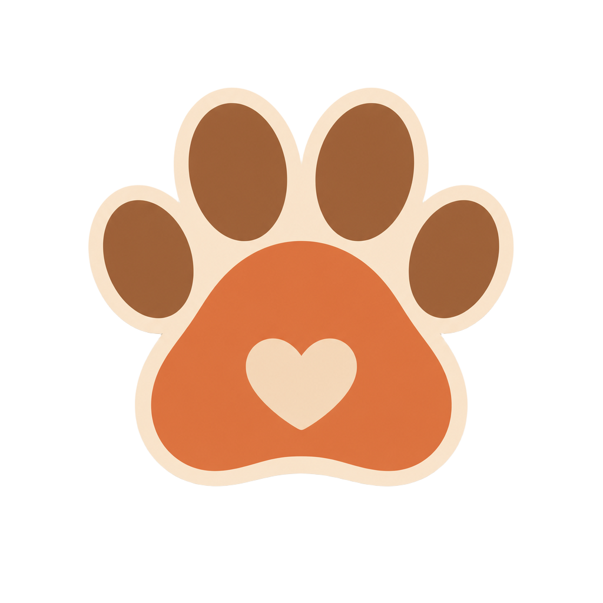

# Patinhas | Tecnologia a Serviço da Proteção Animal

  
  
Uma plataforma que aproxima a comunidade dos abrigos de animais, sem tentar reinventar o que redes de adoção, ração e arrecadação já fazem bem.

 

  
  
  
  
  

---

## Visão Geral

Abrigos de animais convivem com um problema recorrente: falta de recursos básicos, desorganização interna e sobrecarga dos voluntários. Boa parte das plataformas que tentam resolver isso acaba tentando fazer tudo sozinha (seu próprio catálogo de adoção, seu próprio sistema de arrecadação, sua própria logística de doação), reinventando o que redes já consolidadas no Brasil fazem melhor.

O Patinhas nasceu com uma proposta diferente: em vez de competir com o que já existe, ele funciona como uma frente de comunicação e engajamento que conecta a comunidade às redes reais de adoção, doação e arrecadação já estabelecidas no país. Nenhuma doação financeira é processada pela plataforma. Todo o dinheiro passa por canais oficiais e reconhecidos, e o Patinhas atua no que sabe fazer de verdade: aproximar quem quer ajudar de quem já ajuda.

## Destaques

* **Redirecionamento em vez de reinvenção:** cada forma de ajudar (adoção, ração, medicamentos, doação financeira) aponta para plataformas brasileiras reais e verificadas, com uma explicação clara da proposta de cada uma antes do clique.
* **Zero manipulação de dinheiro:** o Patinhas nunca processa, guarda ou administra valores. Só direciona para vaquinhas e campanhas oficiais já existentes.
* **Identidade visual própria:** paleta terrosa, tipografia arredondada e microinterações pensadas para transmitir acolhimento, sem abrir mão de uma cara moderna.
* **Honestidade acima de tudo:** enquanto não houver um abrigo parceiro confirmado, a plataforma não finge ter um catálogo próprio de animais, e prefere apontar para quem já tem.
* **Pensado para crescer:** a estrutura do projeto já prevê a evolução para um painel administrativo de gestão de estoque e animais, assim que houver um abrigo parceiro real.

## Stack Tecnológica

* **Framework:** Next.js 16 (App Router) com React 19.
* **Linguagem:** TypeScript.
* **Estilização:** Tailwind CSS 4, com um design system próprio de cores e tipografia.
* **Animações:** Framer Motion, aplicado em transições de rolagem e microinterações.
* **Componentes:** shadcn/ui como base, com ícones via Lucide.
* **Backend (planejado):** Node.js + Express, com PostgreSQL via Prisma, para quando o painel administrativo entrar em desenvolvimento.

## Licença

Este projeto está licenciado sob a **Licença MIT**. É um projeto de extensão universitária, aberto para ser estudado, adaptado e reaproveitado.

Veja o arquivo `LICENSE` para o texto completo.

---

  
Feito para aproximar quem quer ajudar de quem já ajuda.

